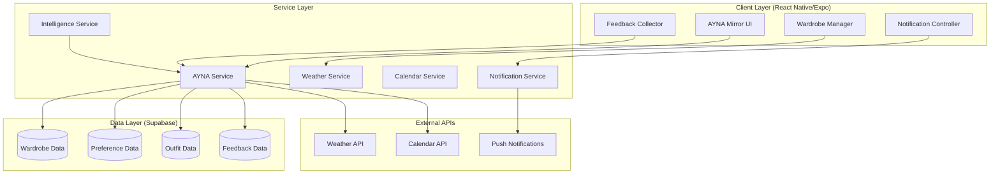

# AYNA Mirror Daily Ritual - Technical Design

## Overview

The AYNA Mirror Daily Ritual is the technical embodiment of AYNAMODA's "Confidence as a Service" philosophy. This system transforms the morning routine from decision fatigue into a confidence-building ritual through intelligent, personalized outfit recommendations delivered at 6 AM daily.

The architecture follows the Digital Zen Garden philosophy with organic, nature-inspired design patterns that create calm confidence through beautiful, intuitive interfaces. The system learns from user interactions to become increasingly personal, creating an addictive loop that helps users feel ready for anything with what they already own.

## Architecture

### High-Level System Architecture



### Core System Components

1. **AYNA Mirror Engine**: The heart of the confidence system that orchestrates daily recommendations
2. **Intelligence Service**: AI-powered learning system that personalizes recommendations
3. **Wardrobe Management**: Digital closet with smart categorization and usage tracking
4. **Notification Orchestrator**: Precise timing and delivery of confidence-building messages
5. **Feedback Loop**: Continuous learning system that improves with every interaction

## Components and Interfaces

### 1. AYNA Mirror Engine (`services/aynaMirrorService.ts`)

The central orchestrator that coordinates all components to deliver the daily confidence ritual.

```typescript
interface AynaMirrorService {
  // Core daily ritual
  generateDailyRecommendations(userId: string): Promise<DailyRecommendations>;
  scheduleNextMirrorSession(userId: string): Promise<void>;

  // Recommendation intelligence
  createOutfitRecommendation(context: RecommendationContext): Promise<OutfitRecommendation>;
  generateConfidenceNote(outfit: Outfit, userHistory: UserHistory): Promise<string>;

  // Learning and adaptation
  processUserFeedback(feedback: OutfitFeedback): Promise<void>;
  updateUserPreferences(userId: string, feedback: OutfitFeedback): Promise<void>;
}

interface DailyRecommendations {
  id: string;
  userId: string;
  date: Date;
  recommendations: OutfitRecommendation[];
  weatherContext: WeatherContext;
  calendarContext?: CalendarContext;
  generatedAt: Date;
}

interface OutfitRecommendation {
  id: string;
  items: WardrobeItem[];
  confidenceNote: string;
  quickActions: QuickAction[];
  confidenceScore: number;
  reasoning: string[];
  isQuickOption: boolean;
}
```

### 2. Intelligence Service (`services/intelligenceService.ts`)

AI-powered personalization engine that learns user preferences and style patterns.

```typescript
interface IntelligenceService {
  // Style learning
  analyzeUserStyleProfile(userId: string): Promise<StyleProfile>;
  updateStylePreferences(userId: string, feedback: OutfitFeedback): Promise<void>;

  // Recommendation algorithms
  generateStyleRecommendations(
    wardrobe: WardrobeItem[],
    context: RecommendationContext,
  ): Promise<OutfitRecommendation[]>;
  calculateOutfitCompatibility(items: WardrobeItem[]): Promise<number>;

  // Confidence scoring
  calculateConfidenceScore(outfit: Outfit, userHistory: UserHistory): Promise<number>;
  predictUserSatisfaction(outfit: Outfit, userProfile: StyleProfile): Promise<number>;
}

interface StyleProfile {
  userId: string;
  preferredColors: string[];
  preferredStyles: string[];
  bodyTypePreferences: string[];
  occasionPreferences: Record<string, number>;
  confidencePatterns: ConfidencePattern[];
  lastUpdated: Date;
}

interface ConfidencePattern {
  itemCombination: string[];
  averageRating: number;
  contextFactors: string[];
  emotionalResponse: string[];
}
```

### 3. Wardrobe Management (`services/wardrobeService.ts` - Enhanced)

Extended wardrobe service with intelligence features for the AYNA Mirror system.

```typescript
interface EnhancedWardrobeService extends WardrobeService {
  // Usage tracking
  trackItemUsage(itemId: string, outfitId: string): Promise<void>;
  getItemUsageStats(itemId: string): Promise<UsageStats>;
  getNeglectedItems(userId: string, daysSince: number): Promise<WardrobeItem[]>;

  // Smart categorization
  categorizeItemAutomatically(imageUri: string): Promise<ItemCategory>;
  extractItemColors(imageUri: string): Promise<string[]>;
  suggestItemTags(item: WardrobeItem): Promise<string[]>;

  // Cost-per-wear tracking
  calculateCostPerWear(itemId: string): Promise<number>;
  getWardrobeUtilizationStats(userId: string): Promise<UtilizationStats>;
}

interface UsageStats {
  itemId: string;
  totalWears: number;
  lastWorn: Date | null;
  averageRating: number;
  complimentsReceived: number;
  costPerWear: number;
}

interface UtilizationStats {
  totalItems: number;
  activeItems: number;
  neglectedItems: number;
  averageCostPerWear: number;
  utilizationPercentage: number;
}
```

### 4. Notification Orchestrator (`services/notificationService.ts`)

Precise timing and delivery system for the daily confidence ritual.

```typescript
interface NotificationService {
  // Daily ritual scheduling
  scheduleDailyMirrorNotification(
    userId: string,
    preferences: NotificationPreferences,
  ): Promise<void>;
  cancelScheduledNotifications(userId: string): Promise<void>;

  // Adaptive timing
  optimizeNotificationTiming(userId: string, engagementHistory: EngagementHistory): Promise<Date>;
  handleTimezoneChange(userId: string, newTimezone: string): Promise<void>;

  // Feedback prompts
  scheduleFeedbackPrompt(userId: string, outfitId: string, delay: number): Promise<void>;
  sendReEngagementMessage(userId: string, daysSinceLastUse: number): Promise<void>;
}

interface NotificationPreferences {
  preferredTime: Date;
  timezone: string;
  enableWeekends: boolean;
  enableQuickOptions: boolean;
  confidenceNoteStyle: 'encouraging' | 'witty' | 'poetic';
}
```

### 5. Feedback Collection (`components/feedback/FeedbackCollector.tsx`)

Beautiful, intuitive interface for capturing user responses that fuel the learning system.

```typescript
interface FeedbackCollector {
  // Rating collection
  collectConfidenceRating(outfitId: string): Promise<number>;
  collectEmotionalResponse(outfitId: string): Promise<EmotionalResponse>;
  collectSocialFeedback(outfitId: string): Promise<SocialFeedback>;

  // Contextual feedback
  collectOccasionFeedback(outfitId: string, occasion: string): Promise<void>;
  collectComfortFeedback(outfitId: string): Promise<ComfortRating>;
}

interface OutfitFeedback {
  outfitId: string;
  userId: string;
  confidenceRating: number;
  emotionalResponse: EmotionalResponse;
  socialFeedback?: SocialFeedback;
  occasion?: string;
  comfort: ComfortRating;
  timestamp: Date;
}

interface EmotionalResponse {
  primary: 'confident' | 'comfortable' | 'stylish' | 'powerful' | 'creative';
  intensity: number;
  additionalEmotions: string[];
}
```

## Data Models

### Core Data Structures

```typescript
// Enhanced wardrobe item with intelligence features
interface WardrobeItem {
  id: string;
  userId: string;
  imageUri: string;
  processedImageUri: string;
  category: ItemCategory;
  subcategory?: string;
  colors: string[];
  brand?: string;
  size?: string;
  purchaseDate?: Date;
  purchasePrice?: number;
  tags: string[];
  notes?: string;

  // Intelligence features
  usageStats: UsageStats;
  styleCompatibility: Record<string, number>;
  confidenceHistory: ConfidenceRating[];
  lastWorn?: Date;
  createdAt: Date;
  updatedAt: Date;
}

// Daily outfit recommendations
interface Outfit {
  id: string;
  userId: string;
  items: WardrobeItem[];
  occasion?: string;
  weatherContext: WeatherContext;
  confidenceScore: number;
  userRating?: number;
  wornDate?: Date;
  feedback?: OutfitFeedback;
  createdAt: Date;
}

// Weather context for recommendations
interface WeatherContext {
  temperature: number;
  condition: 'sunny' | 'cloudy' | 'rainy' | 'snowy' | 'windy';
  humidity: number;
  location: string;
  timestamp: Date;
}

// User preferences and learning data
interface UserPreferences {
  userId: string;
  notificationTime: Date;
  timezone: string;
  stylePreferences: StyleProfile;
  privacySettings: PrivacySettings;
  engagementHistory: EngagementHistory;
  createdAt: Date;
  updatedAt: Date;
}
```

### Database Schema (Supabase)

```sql
-- Enhanced wardrobe items table
CREATE TABLE wardrobe_items (
  id UUID PRIMARY KEY DEFAULT gen_random_uuid(),
  user_id UUID REFERENCES auth.users(id) ON DELETE CASCADE,
  image_uri TEXT NOT NULL,
  processed_image_uri TEXT NOT NULL,
  category TEXT NOT NULL,
  subcategory TEXT,
  colors TEXT[] NOT NULL,
  brand TEXT,
  size TEXT,
  purchase_date DATE,
  purchase_price DECIMAL(10,2),
  tags TEXT[] DEFAULT '{}',
  notes TEXT,
  usage_count INTEGER DEFAULT 0,
  last_worn DATE,
  confidence_score DECIMAL(3,2) DEFAULT 0,
  created_at TIMESTAMP WITH TIME ZONE DEFAULT NOW(),
  updated_at TIMESTAMP WITH TIME ZONE DEFAULT NOW()
);

-- Daily recommendations table
CREATE TABLE daily_recommendations (
  id UUID PRIMARY KEY DEFAULT gen_random_uuid(),
  user_id UUID REFERENCES auth.users(id) ON DELETE CASCADE,
  recommendation_date DATE NOT NULL,
  weather_context JSONB,
  calendar_context JSONB,
  generated_at TIMESTAMP WITH TIME ZONE DEFAULT NOW(),
  viewed_at TIMESTAMP WITH TIME ZONE,
  UNIQUE(user_id, recommendation_date)
);

-- Individual outfit recommendations
CREATE TABLE outfit_recommendations (
  id UUID PRIMARY KEY DEFAULT gen_random_uuid(),
  daily_recommendation_id UUID REFERENCES daily_recommendations(id) ON DELETE CASCADE,
  item_ids UUID[] NOT NULL,
  confidence_note TEXT NOT NULL,
  confidence_score DECIMAL(3,2) NOT NULL,
  reasoning TEXT[],
  is_quick_option BOOLEAN DEFAULT FALSE,
  selected_at TIMESTAMP WITH TIME ZONE,
  created_at TIMESTAMP WITH TIME ZONE DEFAULT NOW()
);

-- User feedback table
CREATE TABLE outfit_feedback (
  id UUID PRIMARY KEY DEFAULT gen_random_uuid(),
  user_id UUID REFERENCES auth.users(id) ON DELETE CASCADE,
  outfit_recommendation_id UUID REFERENCES outfit_recommendations(id) ON DELETE CASCADE,
  confidence_rating INTEGER CHECK (confidence_rating >= 1 AND confidence_rating <= 5),
  emotional_response JSONB,
  social_feedback JSONB,
  occasion TEXT,
  comfort_rating INTEGER CHECK (comfort_rating >= 1 AND comfort_rating <= 5),
  created_at TIMESTAMP WITH TIME ZONE DEFAULT NOW()
);

-- User preferences table
CREATE TABLE user_preferences (
  user_id UUID PRIMARY KEY REFERENCES auth.users(id) ON DELETE CASCADE,
  notification_time TIME NOT NULL DEFAULT '06:00:00',
  timezone TEXT NOT NULL DEFAULT 'UTC',
  style_preferences JSONB DEFAULT '{}',
  privacy_settings JSONB DEFAULT '{}',
  engagement_history JSONB DEFAULT '{}',
  created_at TIMESTAMP WITH TIME ZONE DEFAULT NOW(),
  updated_at TIMESTAMP WITH TIME ZONE DEFAULT NOW()
);
```

## Error Handling

### Graceful Degradation Strategy

The system is designed to provide value even when external services are unavailable:

1. **Weather Service Offline**: Use cached weather data or general seasonal recommendations
2. **Calendar Service Unavailable**: Default to user's typical schedule patterns
3. **AI Service Degraded**: Fall back to rule-based recommendations using user preferences
4. **Notification Service Issues**: Provide in-app fallback with gentle reminders

### Error Recovery Patterns

```typescript
interface ErrorRecoveryService {
  handleWeatherServiceError(userId: string): Promise<WeatherContext>;
  handleAIServiceError(context: RecommendationContext): Promise<OutfitRecommendation[]>;
  handleNotificationError(userId: string, notification: NotificationPayload): Promise<void>;

  // Offline capabilities
  getCachedRecommendations(userId: string): Promise<DailyRecommendations | null>;
  syncPendingFeedback(): Promise<void>;
}
```

## Testing Strategy

### Unit Testing Focus Areas

1. **Intelligence Service**: Style learning algorithms and recommendation logic
2. **AYNA Mirror Engine**: Daily recommendation generation and scheduling
3. **Feedback Processing**: User input validation and preference updates
4. **Wardrobe Management**: Item categorization and usage tracking

### Integration Testing

1. **End-to-End Daily Ritual**: From notification to feedback collection
2. **Cross-Service Communication**: Weather, calendar, and AI service integration
3. **Data Consistency**: Wardrobe updates reflecting in recommendations
4. **Notification Timing**: Accurate scheduling across timezones

### User Experience Testing

1. **Confidence Note Quality**: A/B testing different note styles and tones
2. **Recommendation Accuracy**: Tracking user satisfaction over time
3. **Engagement Patterns**: Monitoring daily ritual adoption and retention
4. **Performance**: Ensuring sub-second response times for daily interactions

## Performance Considerations

### Optimization Strategies

1. **Recommendation Caching**: Pre-generate recommendations for next day
2. **Image Processing**: Optimize wardrobe item images for fast loading
3. **AI Model Efficiency**: Use lightweight models for real-time personalization
4. **Database Indexing**: Optimize queries for user preferences and wardrobe items

### Scalability Architecture

```typescript
interface PerformanceOptimization {
  // Caching strategies
  cacheUserRecommendations(userId: string, recommendations: DailyRecommendations): Promise<void>;
  getCachedRecommendations(userId: string): Promise<DailyRecommendations | null>;

  // Background processing
  preGenerateRecommendations(userId: string): Promise<void>;
  processUserFeedbackAsync(feedback: OutfitFeedback): Promise<void>;

  // Resource management
  optimizeImageStorage(imageUri: string): Promise<string>;
  cleanupOldRecommendations(olderThanDays: number): Promise<void>;
}
```

## Security and Privacy

### Data Protection

1. **Image Encryption**: All wardrobe photos encrypted at rest
2. **Personal Data Anonymization**: Style patterns separated from identifiable information
3. **Secure API Communication**: All external API calls use encrypted channels
4. **User Data Deletion**: Complete data removal within 30 days of account deletion

### Privacy-First Design

```typescript
interface PrivacyService {
  encryptWardrobeImage(imageUri: string): Promise<string>;
  anonymizeStyleData(userId: string): Promise<AnonymizedStyleData>;
  handleDataDeletionRequest(userId: string): Promise<void>;
  auditDataAccess(userId: string, accessType: string): Promise<void>;
}
```

The AYNA Mirror Daily Ritual represents a new paradigm in fashion technology - one that builds confidence through intelligent personalization while respecting user privacy and promoting mindful consumption. This technical architecture transforms your vision of "Confidence as a Service" into a scalable, beautiful, and deeply personal daily ritual.
